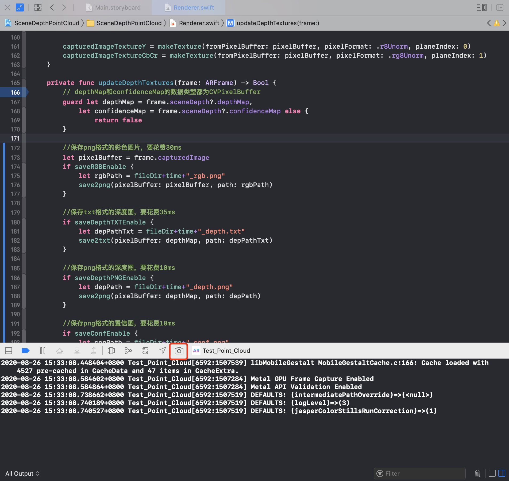
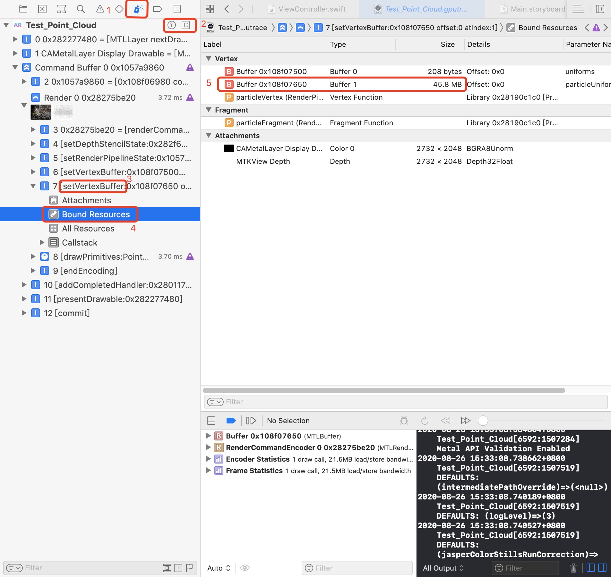
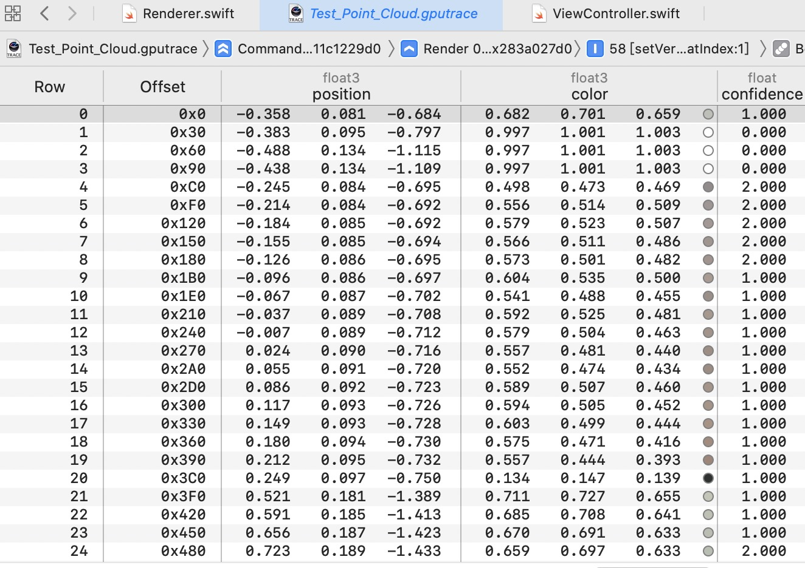

<!-- @import "[TOC]" {cmd="toc" depthFrom=1 depthTo=6 orderedList=false} -->

<!-- code_chunk_output -->

- [项目说明](#项目说明)
- [文件说明](#文件说明)
- [使用方法](#使用方法)
  - [原始数据保存](#原始数据保存)
  - [点云保存](#点云保存)

<!-- /code_chunk_output -->

# 项目说明
本项目基于Apple的官方源码[Visualizing a Point Cloud Using Scene Depth](https://developer.apple.com/documentation/arkit/visualizing_a_point_cloud_using_scene_depth?changes=latest_minor)，将ipad pro的dToF的相关数据（相机参数、彩色图、深度图、置信图、点云）保存到本地。  

# 文件说明
- 文件夹`VisualizingAPointCloudUsingSceneDepth`：基于Apple的官方源码[Visualizing a Point Cloud Using Scene Depth](https://developer.apple.com/documentation/arkit/visualizing_a_point_cloud_using_scene_depth?changes=latest_minor)进行修改，实现导出dToF数据的功能。项目中修改的代码文件如下：  
  - 增加`CVPixelBufferExtension.swift`：主要是对类`CVPixelBuffer`的功能扩展  
  - 修改`Renderer.swift`：增加了使用扩展功能来导出数据的代码  

  其余文件中，修改的地方应该只有增加了注释，并且所有**增加的注释**中都会出现**中文**
 
- 文件夹`Img_for_README`：保存`README.md`中用到的图片  
- 文件夹`TrajectoryVisualization`：可视化相机轨迹
- 文件夹`txt2pcd`：将手动导出的点云数据从txt转为pcd，可以选择是否可视化

# 使用方法
## 原始数据保存
原始数据包括：相机参数（内参、view矩阵、projection矩阵）、RGB、置信图、深度图（png）、深度数据（txt）
- 在MacOS上，使用xcode（**12.0以上版本**），“Open a Project or File”，选择文件夹`VisualizingAPointCloudUsingSceneDepth`，例如  

- 将ipad pro连接到Mac电脑，选择设备为自己ipad，例如  

- 保持ipad为解锁状态，运行项目，然后ipad上会运行程序  

- 采集完数据后，使用快捷键`command`+`shift`+`2`，或者xcode菜单栏打开`Window`->`Devices and Simulators`，选择ipad pro，然后将应用的**数据导出**，导出路径自定

- 导出数据后，后xcode会自动打开访达。对着导出的文件右键，选择`显示包内容`。然后进入文件夹`AppData`，里面的文件夹`Documents`下的文件就是ipad pro的iToF的相关数据，即**相机参数（txt）、RGB（png）、置信图（png）、深度图（png）、深度数据（txt）**  

- 将所有的相机参数文件（txt）放在`./TrajectoryVisualization/camerafiles`下面，然后运行`./TrajectoryVisualization`中的cmake工程，可以可视化相机轨迹

## 点云保存
点云的保存只能通过xcode调试时手动导出
- 将ipad与xcode相连（有线无线都可），然后在xcode上运行程序
- ipad采集完好想要的点云后，在xcode上的调试窗口点击“GPU Frame Capture”

- 找到占用空间很大（一般都是两位数的MB）的一个变量

- 打开可以打开来查看一下，大致长这样

- 右键导出，文件名加个.需要txt后缀

- 将导出的文件放在`./txt2pcd/txt`文件夹下面，然后运行`./txt2pcd`这个cmake工程，可以将txt转换为pcd格式。如果想可视化，可以将`txt2pcd.cpp`中关于可视化的代码取消注释即可

> lldb窗口打开方式：xcode菜单栏`View`->`Debug Area`->`Activate Console`，或者快捷键`command`+`shift`+`c`