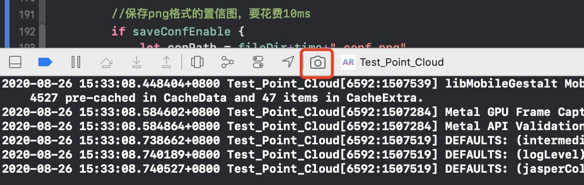
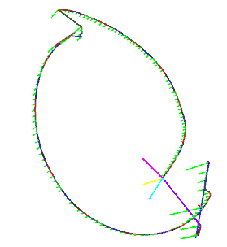

[TOC]

# 项目简介

本项目可以将ipad pro的dToF的相关数据（相机参数、彩色图、深度图、置信图、点云）保存到本地，并提供用于数据分析的各种工具。

# 模块说明

- 文件夹`VisualizingAPointCloudUsingSceneDepth`：基于Apple的官方示例[Visualizing a Point Cloud Using Scene Depth](https://developer.apple.com/documentation/arkit/visualizing_a_point_cloud_using_scene_depth?changes=latest_minor)进行修改，实现导出dToF数据的功能。具体的修改可以跟源码对比。
- 文件夹`TestAnalysis`：各种处理ipad dToF导出数据的工具，比如格式转换、可视化等等。使用c++和cmake构建。


# VisualizingAPointCloudUsingSceneDepth

## 原始数据保存

原始数据包括：相机参数（欧拉角、内参、view矩阵、projection矩阵，\*\_camera.txt）、RGB（\*\_rgb.jpeg）、置信图（\*\_conf.jpeg）、深度图（\*\_depth.jpeg）、深度数据（\*\_depth.txt）
- 在MacOS上，使用xcode（**12.0以上版本**），“Open a Project or File”，选择文件夹`VisualizingAPointCloudUsingSceneDepth`，完成后如下  


- 在文件`Renderer.swift`的开始，有五个bool类型的变量，用于选择想要保存的数据，代码后面有保存一帧那个数据所花费的时间。可以根据自己的需求选择。默认是所有的都保存。

  

- 将ipad pro连接到Mac电脑，选择设备为自己ipad，例如  


- 保持ipad为解锁状态，点击运行（如下图），然后会将程序安装到ipad上，并且ipad上会自动运行程序  


- 采集完数据后，使用快捷键`command`+`shift`+`2`，或者xcode菜单栏打开`Window`->`Devices and Simulators`，选择ipad pro，然后将应用的**数据导出**，导出路径自定


- 导出数据后，后xcode会自动打开访达。对着导出的文件右键，选择`显示包内容`。然后进入文件夹`AppData`，里面的文件夹`Documents`下的文件就是ipad pro的iToF的相关数据，即**相机参数（txt）、RGB（jpeg）、置信图（jpeg）、深度图（jpeg）、深度数据（txt）**。每次启动app产生的以上数据都会保存在一个文件夹中，文件夹名称为启动时间。例如


## 点云保存
点云的保存只能通过xcode调试时手动导出。

而且xcode 12 beta4有个bug，使用该方法调试完后，点击继续，必闪退。

- 将ipad与xcode相连（有线无线都可），然后在xcode上运行程序
- ipad采集完好想要的点云后，在xcode上的调试窗口点击“GPU Frame Capture”

- 在右侧的菜单栏里找到第二个`setVertexBuffer`，不出意外的话，里面有一个占用空间很大（跟点云的数量有关，单位基本上都是MB）的一个变量

- 打开可以打开来查看一下，大致长这样。第1列是点的编号，第2列应该是内存地址，第3列是三维坐标，第4列是RGB信息（被归一化的，大约除了250），第5列是置信度

- 右键导出，文件名自定义，需要加个`_PointCLoud.txt`后缀（因为`TestAnalysis`里相应的工具需要识别文件的`_PointCLoud.txt`后缀名来寻找点云文件）
  


# TestAnalysis

以下工具在Ubuntu 18.04上，使用PCL 1.11、OpenCV 4.4.0、Eigen3、Pangolin，测试通过。


## Comparison

用于判断点云与深度图是否匹配。方法为通过将深度图反投影到三维空间后与点云进行ICP配准，根据配准程度判断是否匹配。此工具的针对性比较强，对于数据的存放格式有较多的要求：

1. `VisualizingAPointCloudUsingSceneDepth`中的`Renderer.swift`，需要将变量`maxPoints`和`numGridPoints`的值改成一致（≤256*192）。`maxPoints`记录的是点云含有点的数量，当满了以后，新来的点会替换最老的点；`numGridPoints`记录的是从一帧深度图均匀采样点的个数。所以当`maxPoints`和`numGridPoints`的值相等时，点云中的点就对应最新深度图中的点

2. 将原始数据的文件夹（包括深度图和相机内参）与点云（.pcd）放在同一文件夹下，且名称相同，例如

    

**使用方法**：编译整个cmake工程，获得可执行文件`Comparison`，在其后面的参数中输入原始数据和点云所在目录（可以包含多组），程序会依次显示每一个场景的匹配效果。例如

```shell
./Comparison ~/Documents/测试数据/4/
```

匹配效果和终端输出如下。图片从左到右：匹配之前的深度反投影（灰色）和点云（彩色），使用手写SVD求解ICP匹配的两个点云，继续使用PCL的ICP匹配的两个点云。终端中输出的error为每个点对的欧式距离之和，单位为m。


注意：工具中使用的两个点云的点对关系为相应位置一一对应。

## ConfidenceVisualization

用于可视化置信图。因为VisualizingAPointCloudUsingSceneDepth在保存置信图（jpeg格式）的时候，会保存为三通道，每个通道的值为0、1、2，这就导致除非显示器对比度很高，否则看到的置信图都是一样的，全都为黑色。所以将置信度0、1、2用蓝色、绿色、红色表示（因为opencv用的是BGR，不是RGB）

**使用方法：**编译整个cmake工程，获得可执行文件`visualization`，在其后面的参数可以为单张置信图或者置信图所在文件夹，可视化后的文件以jpg格式保存，保存在相同路径下。例如

```shell
./visualization ./09-01-20-54-32-370_conf.jpeg	# 单张置信图
./visualization ./confidence/					# 置信图所在文件夹
```

可视化前后对比如下


## depth2pcd

用于将每一帧txt格式的深度数据反投影成点云然后保存.pcd格式。

**使用方法：**编译整个cmake工程，获得可执行文件`depth2pcd`，在其后面的参数中输入一个场景的原始数据所在的文件夹，程序会对文件夹下每一帧的深度图（需要有对应的相机参数文件）进行处理，pcd保存在相同路径下面。例如

```shell
./depth2pcd ~/Documents/测试数据/4/4-正常-场景1/
```

## depth2png

用于将每一帧txt格式的深度数据可视化为png格式、单通道的深度图。转化为深度图时，将最大最小值归一化到255-0，如果最大值会限定在7.5m以下。

**使用方法：**编译整个cmake工程，获得可执行文件`depth2png`，在其后面的参数中输入一个场景的原始数据所在的文件夹，程序会对文件夹下每一帧的深度图（无需对应的相机参数文件）进行处理，png保存在相同路径下面。例如

```shell
./depth2png ~/Documents/测试数据/4/4-正常-场景1/
```

## pcd2xyz

用于将pcd格式的点云转化为xyz格式，用于Geometric Wrap软件。

**使用方法：**编译整个cmake工程，获得可执行文件`pcd2xyz`，在其后面的参数中文件夹路径，程序会将文件夹下每一个pcd格式的点云转化为xyz格式，然后保存在相同路径下面。例如

```shell
./pcd2xyz ~/Documents/测试数据/4/
```

## PCDVisualization

用于可视化点云。

**使用方法：**编译整个cmake工程，获得可执行文件`PCDVisualization`。根据输入参数的不同，有三种可视化模式：

1. 参数为单个pcd文件：仅可视化一个点云
2. 参数为多个pcd文件：同时可视化多个点云。最多支持同时显示6个
3. 参数为文件夹：依次显示文件夹下的所有pcd格式的点云

例如

```shell
./PCDVisualization test1.pcd			# 可视化单个点云
./PCDVisualization test1.pcd test2.pcd	# 同时可视化多个点云
./PCDVisualization ./test/				# 依次可视化文件夹下的所有点云
```


## TrajectoryVisualization：

用于可视化相机的运动轨迹。主要用到的是相机文件的view矩阵（会做一个逆变换）。

**使用方法：**编译整个cmake工程，获得可执行文件`trajectory`，在其后面的参数中输入一个场景的原始数据所在的文件夹。例如

```shell
./trajectory ~/Documents/测试数据/4/4-正常-场景1/
```

效果如下。相机位姿中的x、y、z轴分别用红、绿、蓝表示，其中y轴的长短等于相机当前状态与前后两个状态之间的距离之和；坐标轴的颜色为洋红、天蓝、黄色的表示起点；相邻两个相机姿态使用不同颜色（不包含紫色）的线相连，形成相机运动轨迹；首尾两点使用紫色相连；



PS：如果输入的文件夹中包含了多个场景的原始数据

## txt2pcd

将手动导出的点云数据从txt转为pcd。但是没有使用txt文件中的置信度（最后一列）。

**使用方法：**编译整个cmake工程，获得可执行文件`txt2pcd`，在其后面的参数中输入点云的txt文件所在的文件夹，程序会将文件夹下（包括子目录）所有的txt文件的点云转为pcd格式，并且路径不变。例如

```
./txt2pcd ~/Documents/测试数据/4/
```

